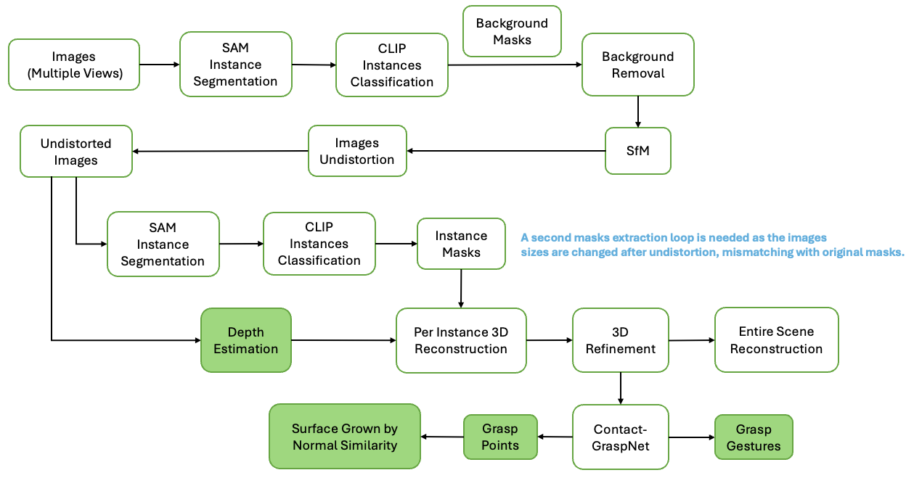
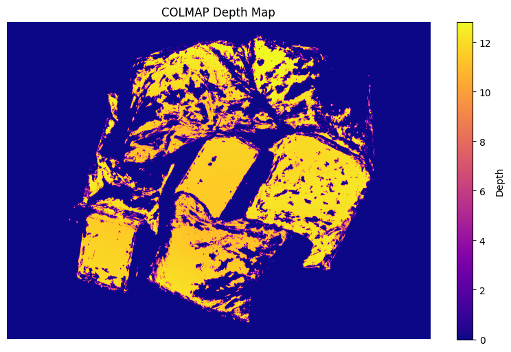
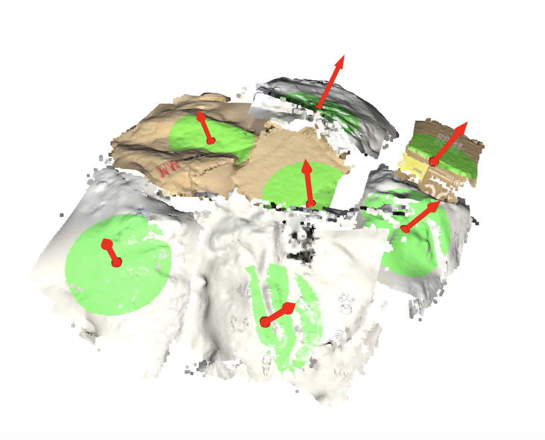
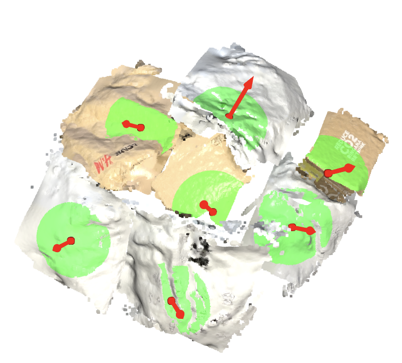
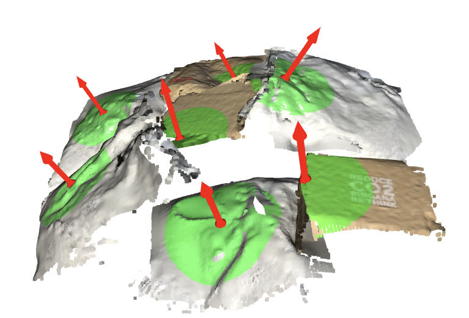

# 3D Grasp Estimation from Multi-View RGB Images

## Method
This workflow estimates the surface normals and best grasp positions using three RGB images as given in the example.  
The workflow is as following, squares marked in green are outputs required by the project instruction:

When building the overflow, I priotized the accuracy, especially the quality of reconstructed 3D point cloud as it heavily affects the surface visualization quality and the accuracy of grasp position prediction by contact-graspnet. Furthermore, there are 2 similar instance -> CLIP cls flow but the second one is for the undistorted images. It is necessary so far as after undistortion the images shapes will change leading to mismatch with masks. 

## Results
### Depth Maps

### Surface with Normals

 
From the third figure it can be seen that the occlusion part is also well reconstructed. 
More intermediate results visulization is kept as cells outputs in the .ipynb file.

## Major Packages
- segment_anything 
- clip 
- hloc 
- open3d 
- contact_graspnet_pytorch

## Bottlenecks and Improvements
I have tried my best working on this project but due to other exams I cannot work on this project in full time. There are some obvious flaws of the model:  
- The depth map is not dense enough. Making it denser can improve the reconstruction quality.
- Current code is not efficient enough, and there are some overlappings among functions. But I have confidence to improve this with more time and if I can split functions into multiple files instead of a single python file.
- The occlusion parts are mainly reconstructed via Poisson reconstruction then prune by checking whether the points violate constraints. This part can be better with other methods like deep-learning models.
- The grasp points extracted from contact-graspnet mainly follow such a priority: Corner > Edge > Surface. As the model trains a hand-like robot arm to get objects, and grasping objects arond high-curvature areas is easier than grabbing a pure surface (if the robot picks parcels by suction cup, pure surfaces should be priotized).

## Other
Beyond what I have implemeted above, I also tried other augmentation methods such as enhance depth map using cv2.impaint, which doesn't bring a significant improvement. A workflow based on pure 2D images (single view) is also built, based on the depth estimation using MiDAS. But the performance is much poorer than multiple-view method therefore is not attached.